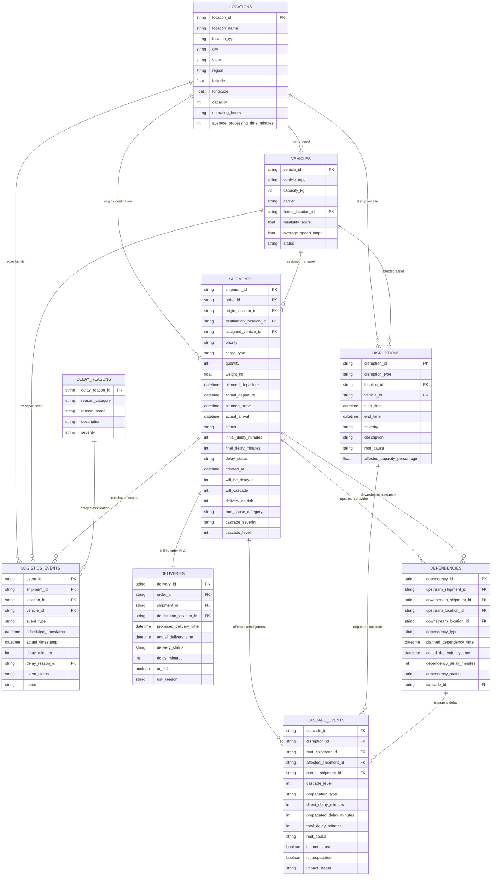

# Cascading Delay Intelligence - Schema Relationships & Entity Mapping

This document details the relational architecture, foreign key mappings, table joins, and cardinality for the **Cascading Delay Intelligence** dataset.

---

## 1. High-Level Entity Relationship Diagram

```text
                  +---------------------------+
                  |         locations         |
                  +---------------------------+
                     ^                     ^
                     | (origin/dest)       | (home_location_id)
                     |                     |
+--------------------+----+         +------+--------------------+
|        shipments        | <-----> |          vehicles         |
+--------------------+----+         +---------------------------+
   |        |        |
   |        |        +-----------------------------------+
   |        |                                            |
   |        v                                            v
   |   +-------------------+                     +--------------------+
   |   | logistics_events  |                     |    dependencies    |
   |   +-------------------+                     +--------------------+
   |            |                                          |
   |            v (delay_reason_id)                        |
   |   +-------------------+                               |
   |   |   delay_reasons   |                               v
   |   +-------------------+                     +--------------------+
   |                                             |   cascade_events   |
   v                                             +--------------------+
+--------------------+                                     ^
|     deliveries     |                                     |
+--------------------+                                     |
                                                 +--------------------+
                                                 |    disruptions     |
                                                 +--------------------+
```

---

## 2. Mermaid Entity Relationship Model



---

## 3. Relational Key Reference Table

| Primary Table | Primary Key | Foreign Table | Foreign Key | Cardinality | Relationship Description |
|---|---|---|---|---|---|
| `locations` | `location_id` | `shipments` | `origin_location_id` | 1 : N | Origin departure facility for shipments. |
| `locations` | `location_id` | `shipments` | `destination_location_id` | 1 : N | Destination receiving facility for shipments. |
| `locations` | `location_id` | `vehicles` | `home_location_id` | 1 : N | Maintenance home depot for fleet assets. |
| `locations` | `location_id` | `logistics_events`| `location_id` | 1 : N | Facility where an operational scan occurred. |
| `locations` | `location_id` | `disruptions` | `location_id` | 1 : N | Site where an operational disruption originated. |
| `vehicles` | `vehicle_id` | `shipments` | `assigned_vehicle_id` | 1 : N | Transport vehicle hauling the consignment. |
| `vehicles` | `vehicle_id` | `logistics_events`| `vehicle_id` | 1 : N | Transport vehicle active during milestone scan. |
| `vehicles` | `vehicle_id` | `disruptions` | `vehicle_id` | 1 : N (nullable) | Transport asset affected by breakdown or inspection hold. |
| `shipments` | `shipment_id` | `logistics_events`| `shipment_id` | 1 : N | Operational milestone scans for the shipment. |
| `shipments` | `shipment_id` | `deliveries` | `shipment_id` | 1 : 1 | Final customer delivery task for the shipment. |
| `shipments` | `order_id` | `deliveries` | `order_id` | 1 : 1 | Customer order reference link. |
| `shipments` | `shipment_id` | `dependencies` | `upstream_shipment_id` | 1 : N | Upstream shipment providing connecting cargo. |
| `shipments` | `shipment_id` | `dependencies` | `downstream_shipment_id` | 1 : N | Downstream shipment receiving transferred cargo. |
| `shipments` | `shipment_id` | `cascade_events` | `affected_shipment_id` | 1 : N | Shipment participant impacted within a cascade tree. |
| `delay_reasons` | `delay_reason_id` | `logistics_events` | `delay_reason_id` | 1 : N (nullable) | Standardized delay cause attributed to an event. |
| `disruptions` | `disruption_id` | `cascade_events` | `disruption_id` | 1 : N | Root incident that triggered the propagation tree. |

---

## 4. Key Analytical Join Paths & Query Patterns

### A. Trace Complete Delay Chain from Root Disruption to Final Customer Delivery
To trace why a customer delivery was late back to the original root cause disruption:

```sql
SELECT 
    d.delivery_id,
    d.order_id,
    d.delivery_status,
    d.delay_minutes AS customer_sla_delay,
    s.shipment_id AS final_shipment_id,
    c.cascade_id,
    c.cascade_level,
    c.propagation_type,
    c.root_cause,
    dis.disruption_type,
    dis.description AS root_incident,
    loc_orig.city AS disruption_city,
    s_root.shipment_id AS root_shipment_id
FROM deliveries d
JOIN shipments s ON d.shipment_id = s.shipment_id
JOIN cascade_events c ON s.shipment_id = c.affected_shipment_id
JOIN disruptions dis ON c.disruption_id = dis.disruption_id
JOIN locations loc_orig ON dis.location_id = loc_orig.location_id
JOIN shipments s_root ON c.root_shipment_id = s_root.shipment_id
WHERE d.delivery_status = 'Delivered Late'
  AND c.propagation_type = 'Customer Delivery Risk';
```

### B. Reconstruct Hub Transfer Connection & Buffer Absorption
To determine whether an inbound shipment's delay was successfully absorbed by the transfer buffer or cascaded into the downstream departure:

```sql
SELECT 
    dep.dependency_id,
    dep.dependency_type,
    dep.upstream_shipment_id,
    s_up.final_delay_minutes AS upstream_arrival_delay,
    dep.downstream_shipment_id,
    s_down.initial_delay_minutes AS downstream_departure_delay,
    dep.dependency_delay_minutes,
    dep.dependency_status,
    loc.city AS transfer_hub
FROM dependencies dep
JOIN shipments s_up ON dep.upstream_shipment_id = s_up.shipment_id
JOIN shipments s_down ON dep.downstream_shipment_id = s_down.shipment_id
JOIN locations loc ON dep.upstream_location_id = loc.location_id
WHERE s_up.final_delay_minutes > 15;
```

### C. Identify Bottleneck Warehouses with Maximum Outbound Cascade Failures
To find which warehouses generate the highest volume of cascading delays:

```sql
SELECT 
    loc.location_id,
    loc.location_name,
    loc.city,
    loc.location_type,
    COUNT(DISTINCT c.cascade_id) AS total_cascades_initiated,
    COUNT(DISTINCT c.affected_shipment_id) AS total_downstream_shipments_affected,
    ROUND(AVG(c.total_delay_minutes), 1) AS avg_delay_minutes
FROM cascade_events c
JOIN shipments s ON c.affected_shipment_id = s.shipment_id
JOIN locations loc ON s.origin_location_id = loc.location_id
WHERE c.is_root_cause = TRUE
GROUP BY loc.location_id, loc.location_name, loc.city, loc.location_type
ORDER BY total_downstream_shipments_affected DESC;
```
